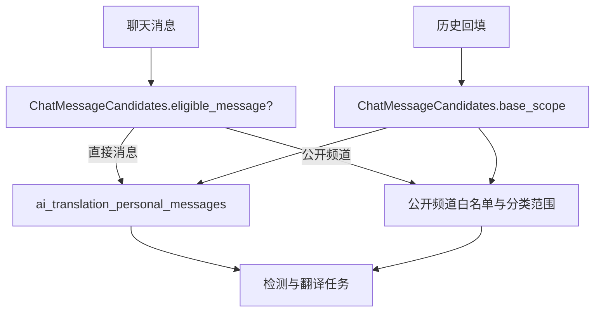
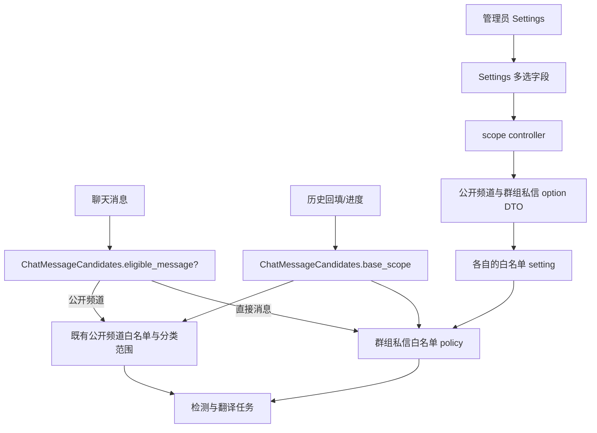

# 群组私信翻译范围 design

## 0. 术语约定

| 术语 | 定义 | 防冲突结论 |
| --- | --- | --- |
| 公开频道白名单 | `ai_chat_translation_allowed_channel_ids`，仅约束 Category 频道；空值表示全部公开频道。 | 保持原名和原语义。 |
| 群组私信白名单 | 本 feature 新增的群组私信频道 ID 集合；空值表示无群组私信。 | 不复用公开频道白名单。 |
| 直接消息资格 policy | 为实时与回填统一判断“一对一拒绝、群组必须在白名单中”的规则。 | 不依赖 Discourse AI 的个人消息全局设置。 |
| Settings 多选字段 | Settings 页的自定义 site-setting renderer；异步加载选项，将 `|` 分隔的 ID 映射为选中项并写回 field。 | 不持有翻译 policy；只消费 scope controller 的 DTO。 |

## 1. 决策与约束

### 需求摘要

管理员需要控制直接消息的翻译用量。插件必须只翻译管理员明确选中的**群组私信**；一对一私信始终不翻译。管理员可管理所有群组私信，候选项仅显示会话名称和频道 ID，不显示成员或消息内容。没有自定义会话名称的群组私信显示通用“群组私信 #频道 ID”标签，不从成员名推导标题。

本能力不改变公开频道的现有白名单语义：公开频道留空仍表示全部公开频道；群组私信留空则表示不翻译任何群组私信。

### 现状

`ChatMessageCandidates` 同时承担实时资格判定、历史回填 scope、进度统计和公开频道后台选项。直接消息资格目前在 `eligible_channel?` 与 `base_scope` 中读取 Discourse AI 的 `ai_translation_personal_messages`（`all` / `group` / `none`），因此公开频道白名单不会限制直接消息。

### 变化

新增插件独立设置 `ai_chat_translation_allowed_direct_message_channel_ids`，默认空列表。它是本插件对直接消息的**唯一**资格来源：

- 一对一私信：始终无资格；
- 群组私信：仅当频道 ID 在该设置中时有资格；
- 空列表：没有任何直接消息有资格。

插件的直接消息路径不再读取 `ai_translation_personal_messages`。这是刻意的行为收紧：升级后，原先由该全局设置自动翻译的直接消息会停止翻译，直到管理员显式加入群组私信白名单。

为避免把后台查询与翻译候选规划继续堆进 `ChatMessageCandidates`，新增 Settings 专用的 scope controller，并由独立的群组私信选项 provider 查询全部群组私信。管理员不必是成员，且群组私信 DTO 只返回 `id` 和 `title`。Dashboard 不承担设置编辑。

复杂度：默认档位；不引入新 API、表或后台权限模型。

明确不做：

- 不支持一对一私信翻译或其单独开关；
- 不提供“翻译所有群组私信”的空列表快捷语义；
- 不展示成员、参与关系、消息数量、消息内容或翻译进度的会话级明细；
- 不修改公开频道的白名单设置、含义或选项 provider；
- 不迁移既有直接消息翻译记录，也不删除已有译文。

## 2. 名词与编排

### 2.1 名词层

#### 现状

公开频道使用 `ai_chat_translation_allowed_channel_ids`，经 `ChatMessageCandidates.allowed_channel_ids` 解析；该配置的空值表示全部公开频道。`Admin::TranslationScopeOptions` 返回公开频道选项；群组私信选项由独立 provider 返回。

#### 变化

引入两个独立概念：

- **群组私信白名单**：新 site setting 持久化的群组私信频道 ID 集合；解析后用于资格判定和回填 scope。其空集合的含义固定为全部拒绝。
- **群组私信选项**：scope controller 输出的 `{ id, title }`。`title` 仅采用群组私信的自定义会话名称；名称为空时使用通用“群组私信 #频道 ID”标签，绝不从参与者信息推导。它不是翻译资格策略，也不承载公开频道 DTO。

直接消息资格收敛为独立 owner `AiChatTranslation::DirectMessageTranslationPolicy`，逻辑等价于：

```text
group direct-message channel && allowed_direct_message_channel_ids.include?(channel.id)
```

该 policy 独占新 setting 的读取/ID 解析、单频道资格判断和供 `base_scope` 使用的 scope 条件；`ChatMessageCandidates` 不新增直接消息白名单或判断方法。policy 不接受也不检查 `force:`；该参数只能影响已有译文的重翻译行为，不能放宽消息、用户或频道资格。

### 2.2 编排层

#### 现状



实时创建、编辑后的任务和手动翻译控制器都会调用 `eligible_message?`；历史语言检测、翻译回填和进度统计都会使用 `base_scope`。因此两条入口必须采用同一直接消息 policy。

#### 变化



- `ChatMessageCandidates` 保留公开频道资格和统一的消息 / 用户前置检查；它只委托 `DirectMessageTranslationPolicy` 的单频道判断，并在 `base_scope` 中使用 policy 提供的 scope 条件。它不解析群组私信 setting，也不拥有群组私信资格方法。该 scope 必须同时排除一对一私信和未选中的群组私信。
- 手动翻译控制器、消息创建任务与编辑重翻译任务继续走 `eligible_message?`；`force: true` 不可绕过直接消息 policy。
- 历史回填与进度聚合继续复用 `base_scope`，所以白名单变更会同时影响待处理数量和统计总量。
- `progress_cache_key` 纳入 `DirectMessageTranslationPolicy` 的配置标识并提升版本；移除对 `ai_translation_personal_messages` 的依赖，避免其改变导致本插件进度缓存失效或混淆策略来源。
- 新的 scope controller 编排 `AiChatTranslation::Admin::TranslationScopeOptions` 与 `AiChatTranslation::Admin::GroupDirectMessageOptions`，并输出独立选项数组；`ChatMessageCandidates` 不参与任何 UI 查询。provider 仅使用显式会话名称；为空时返回通用“群组私信 #频道 ID”标签，不能调用会从参与者导出标题的 API。Settings 的两个自定义字段以可搜索多选下拉框分别消费对应数组，将选中 ID 写回各自 site setting；不合并选项来源或白名单语义。Dashboard 仅请求并显示进度。

#### 跨层纪律

- **权限与隐私**：后台路由维持 `AdminConstraint`；provider 可查询管理员未参与的群组私信，但只序列化名称和 ID，禁止附带成员、消息内容、消息计数或翻译记录。
- **一致性**：实时 eligibility 与 ActiveRecord 回填 scope 是同一业务规则的两种表达，修改一方必须以另一方的契约测试校验。手动 `force:` 只影响重新生成译文，不影响范围策略。
- **兼容性风险**：这是有意的 fail-closed 变更。发布时原先由 `ai_translation_personal_messages` 覆盖的所有直接消息会立即停止自动翻译；管理员必须显式选择群组私信后才会恢复。已有译文保持可读。

### 2.3 挂载点

1. 新 site setting：删除它则没有独立的群组私信范围可配置。
2. 直接消息资格 policy：删除它会使实时和回填无法共享“仅白名单群组私信”的规则。
3. `base_scope` 的直接消息条件：删除它会使历史回填和进度统计重新纳入不允许的私信。
4. Settings scope controller 与自定义多选字段：删除它后管理员不能以名称/ID维护白名单。
5. 进度缓存键：删除它会使配置变更后短时间内显示旧范围统计。

### 2.4 推进策略

1. **策略与配置骨架**：以 `DirectMessageTranslationPolicy` 增加独立 setting 读取/解析、频道资格和 scope 条件；让实时资格判定只经该 owner 决定直接消息资格。退出信号：一对一与未白名单群组私信均不可翻译，且不读取全局个人消息设置。
2. **回填与缓存一致性**：将 policy 提供的 scope 条件接入 `base_scope`，并将其配置标识接入进度缓存键。退出信号：回填、进度与实时资格在同一消息集上结论一致。
3. **后台数据边界**：实现 `Admin::GroupDirectMessageOptions` provider 与 scope controller，分别返回公开频道和群组私信选项，且不返回成员或消息数据。退出信号：管理员能维护白名单，而 scope controller 与 `ChatMessageCandidates` 均不混入对方职责。
4. **Settings 交互与文案**：为两个 ID setting 注册独立的可搜索多选 renderer；异步加载、映射并写回各自 field。退出信号：两个下拉框的选项来源、保存目标和空列表语义互不影响，Dashboard 不再编辑设置。
5. **验证**：补充 policy、实时/手动、回填、缓存、scope controller 与 Settings 字段的回归覆盖。退出信号：验收契约全部通过，既有公开频道行为仍受原测试保护。

## 3. 验收契约

| 场景 | 输入 / 触发 | 可观察结果 |
| --- | --- | --- |
| 一对一私信 | 创建、编辑或手动请求翻译一对一私信消息 | 不入队或控制器返回不可翻译；历史回填与进度不计入该消息。 |
| 空群组私信白名单 | 白名单为空后产生或回填任意群组私信消息 | 不翻译、不计入回填或进度。 |
| 未选择群组私信 | 白名单不含该群组私信频道 ID | 实时、编辑重翻译、手动 `force:` 请求与回填均拒绝。 |
| 已选择群组私信 | 白名单含该群组私信频道 ID 且消息、用户与插件前置条件均有效 | 实时任务与回填可将其作为候选；全局 `ai_translation_personal_messages` 的任意值不改变结果。 |
| 白名单变更 | 管理员保存不同的群组私信 ID 集合 | 后续实时资格立刻按新范围执行；进度请求不复用旧范围缓存。 |
| Settings 选择 | 管理员打开 Settings 并搜索或选择选项 | 公开频道与全部群组私信各自以可搜索多选下拉框显示；群组私信显示自定义名称（无名称时为通用频道 ID 标签）和 ID，并写回各自 setting；响应和界面不显示成员、消息内容或消息数量。 |
| Dashboard | 管理员打开 Dashboard | 只显示按当前白名单范围计算的翻译进度，不显示或修改设置。 |
| 公开频道回归 | 修改群组私信白名单或保留其为空 | 公开频道仍只受既有公开频道白名单和分类范围控制；公开频道空白名单仍代表全部公开频道。 |

## 4. 与项目级架构文档的关系

仓库当前没有 `codestable/architecture/` 系统地图。本 feature 的系统级稳定信息是“直接消息翻译采用独立、fail-closed 的群组白名单 policy”，以及后台可管理全部群组私信但只暴露名称/ID 的隐私约束。验收阶段应在建立或更新架构文档时沉淀这两项；其余 provider 与前端状态属于模块内部实现。

可卸载性：删除新 setting、policy、scope 分支与 dashboard 区块后，插件恢复为没有群组私信翻译的公开频道翻译行为；不需要数据迁移或清理。
